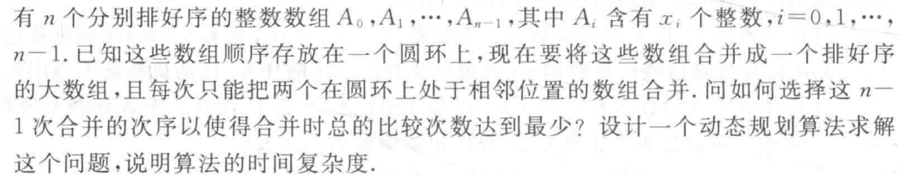
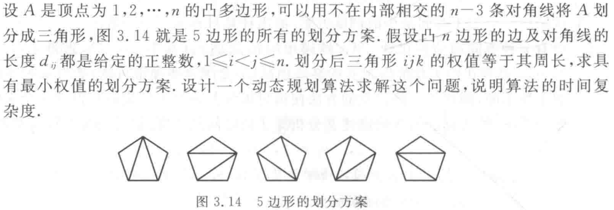

# 动态规划

这里记录部分动态规划较难解之题目，方便日后复习。

## 数组合并问题

题目系《算法设计与分析》第3章习题3.11。

分析这个问题，与矩阵链乘法问题很类似，可以用段的端点确定子问题的边界。不同之处在于这里是一个环，如果用 $m[i,j]$ 表示合并 $i,j$ 之间的数组（包含 $i, j$ ）的最少比较次数，很容易注意到 $i=j$ 时， $m[i,j] = 0$ ，合并两个数组最坏情况下最少需要两个数组元素数和减一， $i < j$ 的时候成立递推式

$$
m[i, j] = \mathop{min}_{i\le k\lt j}\{m[i,k] + m[k+1,j] + \sum\limits_{t=i}^{j}n_t - 1\}
$$

当 $i > j$ 的时候成立递推式

$$
m[i, j] = \mathop{min}_{i\le k \lt n, 0\le t \lt j}\{m[i,k] + m[k+1,j] + \sum\limits_{t=i}^{n-1}n_t + \sum\limits_{t=0}^jn_t - 1\}
$$

使用动态规划算法可以求解，最坏情况下时间复杂度为 $O(n^3)$ 。

## 凸多边形划分问题

题目系《算法设计与分析》第3章习题3.12。

划分子问题 $A[i,j]$ 为顶点为 $i,...,j$ 组成之凸多边形，则原问题即 $A[1,n]$ 问题。假设 $A[i,j]$ 最小权值的划分方案的最小权值为 $m[i,j]$ ，则 $m[i,i+1]=0$ ，考虑划分 $A[i,j]$ ，取 $i,j$ 中的一个顶点 $k$ ，将其与 $i,j$ 连线构成三角形 $ijk$ ，并划分出两个子问题 $A[i,k]$ 和 $A[k,j]$ ，即有递推式

$$
m[i,j] = \mathop{min}_{i\lt k\lt j}\{m[i,k] + m[k,j] + d_{ij} + d_{ik} + d_{jk}\}
$$

使用动态规划方法即可求解之，最坏情况下时间复杂度为 $O(n^3)$ 。
