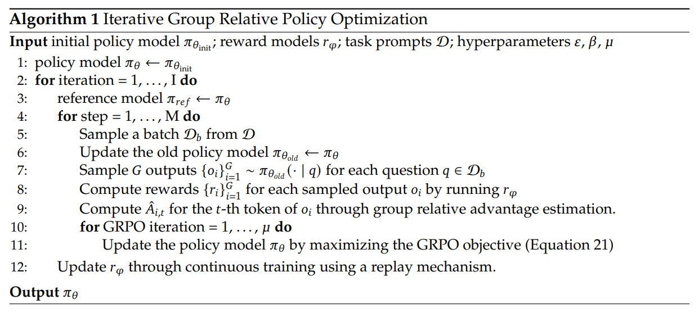

# GRPO及其后续改进

本文将详细介绍GRPO和后续的各种改进，主要围绕一系列论文展开，论文列表来自于[这个仓库](https://github.com/xhyumiracle/Awesome-AgenticLLM-RL-Papers?tab=readme-ov-file#sec27-agentic-rl-algorithms)。

> [!INFO] AI使用声明
> 本文部分数学公式的Latex使用Qwen识别然后提供

## 前置知识

要完全的介绍GRPO的前置知识，则几乎不可避免要从强化学习的基本概念开始，或者至少从策略梯度开始，这需要不少的篇幅，我也不认为我的理解能将这么多内容讲解清楚，所以这里我们只从PPO开始。如果希望了解更多的前置知识，以下资料或许有帮助

[【策略梯度定理】推导、证明、深入理解与代码实现](https://zhuanlan.zhihu.com/p/491647161)

[强化学习进阶 第七讲 TRPO](https://zhuanlan.zhihu.com/p/26308073)

[Proximal Policy Optimization (PPO) 算法理解：从策略梯度开始](https://zhuanlan.zhihu.com/p/614115887)

PPO，即Proximal Policy Optimization或近端策略优化，是OpenAI在2017年提出的一种策略优化算法，论文在[这里](https://arxiv.org/pdf/1707.06347)。PPO主要是在之前的[TRPO](https://arxiv.org/pdf/1502.05477)上做的改进，它实际上有两个版本，分别是Clipped版本和自适应KL惩罚版本，即PPO-Clip和PPO-Penalty，其中PPO-Clip流传最广，以至于后来称PPO默认都是指PPO-Clip。

PPO-Clip的优化目标是

$$
L^{\text{CLIP}}(\theta) = \hat{\mathbb{E}}_t\left[\min(r_t(\theta)\hat{A}_t, \text{clip}(r_t(\theta), 1 - \epsilon, 1 + \epsilon)\hat{A}_t)\right]
$$

这里的 $r_t(\theta)$ 是重要性采样中的重要性比率，即

$$
r_t(\theta) = \frac{\pi_\theta(a_t \mid s_t)}{\pi_{\theta_{\text{old}}}(a_t \mid s_t)}
$$

$\hat{A}_t$ 表示优势函数的估计，所谓优势函数，即指当前的状态-动作价值函数或者其他的策略梯度定理中允许在这一项的函数减去一个基线（实际上通常就是期望），减去基线目的在于减小方差，在人类反馈强化学习中，这个基线通常是有另一个模型预测，该模型称为价值模型或评论模型。

我们进行clip操作，主要是隐性地约束更新的步伐不要过大，并采用悲观的策略与没有clip操作的目标取其较小值。PPO使用这个clip实现了对模型更新后与参考模型的差距的约束，从而不再使用TRPO中的KL惩罚项。

PPO是一个重要的策略梯度优化算法，ChatGPT的训练中的人类反馈强化学习就是用的PPO。在人类反馈强化学习中，对于大语言模型，我们如果把生成一个标记（token）视为一个动作的话，那么PPO的公式就变成了

$$
\mathcal{J}_{\text{PPO}}(\theta) = \mathbb{E}_{[q \sim P(Q),\, o \sim \pi_{\theta_{\text{old}}}(O|q)]} \left[ \frac{1}{|o|} \sum_{t=1}^{|o|} \min \left[ \frac{\pi_\theta(o_t | q, o_{<t})}{\pi_{\theta_{\text{old}}}(o_t | q, o_{<t})} A_t,\, \text{clip} \left( \frac{\pi_\theta(o_t | q, o_{<t})}{\pi_{\theta_{\text{old}}}(o_t | q, o_{<t})}, 1 - \varepsilon, 1 + \varepsilon \right) A_t \right] \right]
$$

这里基本就是把PPO的公式套到了人类反馈强化学习中而已，所谓的策略模型，实际上就是要训练的语言模型，这里有所不同的是优势函数 $\hat{A}$ 计算中基线或者价值的计算，是由一个价值模型计算得到的，它也在训练的过程中更新，它的优化目标有很多种，但基本的思想都是求与期望折扣奖励的均方误差。为了缓解奖励函数的过度优化，通常不会直接把奖励模型得到的奖励分数作为实际使用的奖励，而是要减去KL惩罚。根据[论文](https://arxiv.org/pdf/2009.01325)的解释，这个KL惩罚主要有两个作用：

1. 作为熵奖励，鼓励策略模型进行探索
2. 确保模型不会生成与奖励模型训练时见过的语料差距过大的内容

::: tip
实事求是地讲，我并没有完全理解这里KL惩罚的作用，上面的解释我也只是直接从论文翻译来的
:::

## GRPO

观察上面PPO的优化目标，我们不仅需要训练本来的大语言模型（也称策略模型），还需要训练一个价值模型，它的大小经常与策略模型相当，这对显存和计算能力有相当的耗费，同时也带来了训练的不稳定等问题。为此，DeepSeek提出了GRPO（Group Relative Policy Optimization，分组相对策略优化），抛弃了价值模型，改为使用多个样本的平均奖励作为基线，论文在[这里](https://arxiv.org/pdf/2402.03300)。

:::details GRPO的引用问题
很多论文提到GRPO的时候总是引用DeepSeek-R1的[论文](https://arxiv.org/pdf/2501.12948)，但实际上GRPO是DeepSeek在DeepSeek-R1之前的DeepSeekMath就提出了，他们在DeepSeek-R1中提到GRPO也是引用的DeepSeekMath，但DeepSeek-R1影响太大，以至于大家想到GRPO第一反应都是DeepSeek-R1。
:::

GRPO的优化目标是

$$
\mathcal{J}_{\text{GRPO}}(\theta) = \mathbb{E}_{q \sim P(Q), \{o_i\}_{i=1}^G \sim \pi_{\theta_{\text{old}}}(O|q)} \left[ \frac{1}{G} \sum_{i=1}^G \frac{1}{|o_i|} \sum_{t=1}^{|o_i|} \{\min\left( \frac{\pi_\theta(o_{i,t}|q, o_{i,<t})}{\pi_{\theta_{\text{old}}}(o_{i,t}|q, o_{i,<t})} \hat{A}_{i,t},\ \text{clip}\left( \frac{\pi_\theta(o_{i,t}|q, o_{i,<t})}{\pi_{\theta_{\text{old}}}(o_{i,t}|q, o_{i,<t})},\ 1 - \varepsilon,\ 1 + \varepsilon \right) \hat{A}_{i,t} \right) - \beta \mathbb{D}_{\text{KL}}\left[\pi_\theta \,\|\, \pi_{\text{ref}}\right] \right]\}
$$

符号的意义基本上跟PPO是一样的，区别主要在于 $\hat{A}$ 表示的优势是相对于分组内的优势。具体而言，对于基于结果的奖励，我们对一个分组的 $G$ 个样本分别给出其奖励分数 $\mathbf{r} = \{r_1, r_2, \cdots, r_G\}$ ，那么对于第 $i$ 个样本，它的优势计算公式是

$$
\hat{A}_{i,t} = \tilde{r}_i = \frac{r_i - \text{mean}(\mathbf{r})}{\text{std}(\mathbf{r})}
$$

实际上每个标记的奖励和优势是相同的。如果是基于过程的奖励，那么需要把对应的 $r_i$ 改为该标记所在过程的奖励，而平均值和标准差需要对所有样本的所有过程奖励求取，即我们对于 $G$ 个样本得到了奖励 $\mathbf{R} = \left\{ \left\{ r_1^{\text{index}(1)}, \ldots, r_1^{\text{index}(K_1)} \right\}, \ldots, \left\{ r_G^{\text{index}(1)}, \ldots, r_G^{\text{index}(K_G)} \right\} \right\}$ ，对应的 $r_i^{\text{index}(j)} = \frac{r_i^{\text{index}(j)} - \text{mean}(\mathbf{R})}{\text{std}(\mathbf{R})}$ ，于是优势为

$$
\hat{A}_{i,t} = \sum_{\text{index}(j) \geq t} \widetilde{r}_i^{\text{index}(j)}
$$

与此同时，GRPO不再将KL惩罚添加在奖励上，而是直接加在优化目标上，也即上面我们看到的 $\mathbb{D}_{\text{KL}}\left[\pi_\theta \,\|\, \pi_{\text{ref}}\right]$ ，以简化 $\hat{A}_{i,t}$ 的计算。与PPO中的KL散度计算不同的是，这里用的是KL散度的一个无偏估计

$$
\mathbb{D}_{KL}\left[\pi_\theta \mid\mid \pi_{\text{ref}}\right] = \frac{\pi_{\text{ref}}(o_{i,t} \mid q, o_{i,<t})}{\pi_\theta(o_{i,t} \mid q, o_{i,<t})} - \log \frac{\pi_{\text{ref}}(o_{i,t} \mid q, o_{i,<t})}{\pi_\theta(o_{i,t} \mid q, o_{i,<t})} - 1
$$

实际在大语言模型的强化学习中，GRPO的一个基本流程如下所示

:::tip
GRPO提出是在DeepSeekMath，后来应用于DeepSeek-R1，这两个模型的训练中，用到GRPO的都是推理能力的增强，而不再是之前的人类反馈强化学习，它们的奖励函数多是基于结果或基于过程的奖励，不是之前的由表示人类偏好的奖励模型给出。
:::

:::tip GRPO是on-policy还是off-policy？
从公式来看GRPO是off-policy的，因为我们使用了之前旧的策略产生的样本然后进行重采样，但实际在DeepSeekMath的论文中，DeepSeek进行的是on-policy的强化学习，每一次采样后仅更新一次模型（源自[知乎文章](https://zhuanlan.zhihu.com/p/1932770229693450218)的评论区）。后续的DeepSeek-R1是on-policy还是off-policy，这个就不得而知了，论文中没有明确提及这一点，我的猜测是off-policy的，DeepSeekMath训练时模型相对较小，数据也相对较少，on-policy或许还能支持，但到了DeepSeek-R1，或许off-policy就难以避免了。
:::

## 后续改进

GRPO提出后，特别是DeepSeek-R1引起广大关注后，由于其训练稳定、显存占用少（少于PPO）、实现简单等优势，已经成为现今大多数对于大语言模型的强化学习训练，特别是针对模型推理能力的训练的首先选择。与此同时，也有不少人提出了一些对其的改进，它们中有些也体现出比较深刻的观察并得到足够的实验的验证。

### DAPO

DAPO是字节跳动和清华大学提出的一个对GRPO的改进，其全称是裁剪解耦与动态采样策略优化（**D**ecoupled
Clip and **D**ynamic s**A**mpling **P**olicy **O**ptimization），论文在[这里](https://arxiv.org/pdf/2503.14476)，其优化目标为

$$
\begin{array}{l}
\mathcal{J}_{\text{DAPO}}(\theta) = \mathbb{E}_{(q,a)\sim\mathcal{D},\,\{o_i\}_{i=1}^G\sim\pi_{\theta_{\text{old}}}(\cdot\mid q)} \left[ \frac{1}{\sum_{i=1}^G |o_i|} \sum_{i=1}^G \sum_{t=1}^{|o_i|} \min\left(r_{i,t}(\theta)\hat{A}_{i,t},\ \text{clip}\left(r_{i,t}(\theta), 1 - \varepsilon_{\text{low}}, 1 + \varepsilon_{\text{high}}\right)\hat{A}_{i,t}\right) \right] \\
\text{s.t.}\quad 0 < \left| \left\{ o_i \mid \text{is\_equivalent}(a, o_i) \right\} \right| < G
\end{array}
$$

其中

$$
r_{i,t}(\theta) = \dfrac{\pi_\theta(o_{i,t} \mid q, o_{i,<t})}{\pi_{\theta_{\text{old}}}(o_{i,t} \mid q, o_{i,<t})}, \quad 
\hat{A}_{i,t} = \dfrac{R_i - \text{mean}(\{R_i\}_{i=1}^G)}{\text{std}(\{R_i\}_{i=1}^G)}
$$

它主要做的改进包括四个方面：

#### 提高裁剪的上界

这个改进主要基于研究团队在GRPO训练过程中观察到的一个现象——策略模型输出的熵快速下降。这意味着模型随着训练的进行，越来越倾向于利用之前的经验，而很少进行新的探索。研究团队认为，这跟裁剪的上界有关，他们认为，同样的裁剪上界 $\epsilon$ ，对于较高概率的行为，其被限制后仍然能达到很高的概率，但较低概率的行为，则限制更严。这个某种意义上是有道理的，因为我们裁剪的是重要性比率，即 $\dfrac{\pi_\theta}{\pi_{\theta_{\text{old}}}}$ ，实际作用到 $\pi_\theta$ 上的上界是 $(1+\epsilon)\pi_{\theta_\text{old}}$ ，原来 $\pi_{\theta_\text{old}}$ 越高的，其能增加的也越高。研究团队实验也发现，被上界裁剪的确实多是一些概率较低的标记。于是研究团队将重要性比率裁剪的上下界进行了解耦，允许使用不同的 $\epsilon$ ，其中 $\epsilon_{\text{high}}$ 会设置的更大一些。

#### 动态采样

GRPO中，使用基于规则的奖励，优势的计算是用奖励减去分组的平均奖励再除以分组奖励的标准差，如果对于一个提示词的准确率为0或1，那么所有的奖励都相同，于是优势变为0，导致没有产生梯度更新。在实际训练中，我们不是一个分组一个分组的进行训练，而是会有一个批次的分组同时计算梯度更新，一个分组的梯度更新为0事实上导致了训练批次的梯度更新变小，也带来了批次的梯度更新的方差变大，产生噪声。于是研究团队采用了动态采样的策略，过滤掉准确率为0或1的分组，不断采样直到批次内的所有分组的准确率都不为0和1。

#### 使用标记级别的损失

这主要是针对长思维链强化学习场景提出的改进，在原来GRPO中，分组内每个样本的损失被赋予了相同的权重（我们是先求每个标记的平均损失，然后再求每个样本的平均损失），这导致了长的优质回答不容易被学习，而长的错误模式（比如不必要的重复等）又不容易被惩罚，导致回答的熵和长度出现异常的增长。研究团队对此提出了新的损失计算方法，每个样本的损失赋予一个等于其响应长度的权重，实际上写成公式就是标记级别的损失。

:::tip
这个改变不太容易发现，因为我们观察一个公式的时候有时不会去看外面的求和符号～
:::

#### 超长奖励调整

论文主要研究的是长思维链推理能力的增强，对于一些问题，模型的响应可能会过长，超过了预设的长度限制，传统的做法是进行截断并赋予一个长度惩罚，但这样未免有些粗暴。论文研究团队首先实验了直接在计算损失时不计入被截断的过长样本的损失，发现这样可以很好地稳定训练并提升模型表现。随后，论文研究团队又提出了一个弹性超长惩罚，对于被截断的过长样本，在一定的区间内不予惩罚，超过一定程度后逐步线性增加惩罚，直到一个预设的最大长度，惩罚保持为-1。即

$$
\begin{array}{l}
R_{\text{length}}(y) = 
\begin{cases}
0, & |y| \leq L_{\max} - L_{\text{cache}} \\
\dfrac{(L_{\max} - L_{\text{cache}}) - |y|}{L_{\text{cache}}}, & L_{\max} - L_{\text{cache}} < |y| \leq L_{\max} \\
-1, & L_{\max} < |y|
\end{cases}
\end{array}
$$

:::tip
我们可以看到，这篇论文很多改进都是研究团队基于在实验中发现的问题提出的，这也是大语言模型训练中一个常见的情况，有些想法可能看起来很简单，但确实能解决对训练有很大影响的问题。
:::

:::tip
这篇论文的排版和书写还是挺好的，特别是有一些详细的对比和颜色标注，很多问题看我的文章的语言描述后无法理解的，可以看原论文，会更容易理解一些。
:::

### GSPO

GSPO（Group Sequence Policy Optimization，分组序列策略优化）是阿里巴巴的千问团队提出的一个对于GRPO的改进，其核心要义在于将原先GRPO中标记级别的重要性比率裁剪改为序列接别的，从而增强训练的稳定性。论文在[这里](https://arxiv.org/pdf/2507.18071)可以获取，论文比较简短，但也很清楚，也可以阅读他们的[中文博客](https://qwenlm.github.io/zh/blog/gspo/)。

要理解GSPO设计的理念，我们需要回到重要性比率的意义，实际上如果你还记得[策略梯度定理](https://zhuanlan.zhihu.com/p/491647161)和TRPO的推导的话，就会知道这里我们引入重要性比率本质上在提高样本的利用率，我们在策略梯度定理的推导中引入了一个期望，我们通过采样求平均的方式来近似，但是每次模型更新都重新采样对计算资源会带来巨大的浪费，于是我们使用重采样，使用之前策略产生的样本但乘以一个重要性比率，它主要的数学依据是

$$
\mathbb{E}_{z \sim \pi_{\text{tar}}} \left[ f(z) \right] = \mathbb{E}_{z \sim \pi_{\text{beh}}} \left[ \frac{\pi_{\text{tar}}(z)}{\pi_{\text{beh}}(z)} f(z) \right]
$$

GRPO中，重要性比率是对每个标记计算并应用的，但我们的奖励或者优势又往往是对于整个序列而言的，这违背了原来重要性比率设计的理念，给训练梯度带来了高方差的噪声，这个噪声会随着长序列而累积并被裁剪操作放大。据此，千问的团队提出了GSPO，在序列级别上应用重要性比率。

具体的，一般的GSPO的优化目标为

$$
\mathcal{J}_{\text{GSPO}}(\theta) = \mathbb{E}_{x \sim \mathcal{D},\, \{y_i\}_{i=1}^G \sim \pi_{\theta_{\text{old}}}(\cdot \mid x)} \left[ \frac{1}{G} \sum_{i=1}^G \min\left( s_i(\theta) \hat{A}_i,\ \text{clip}\left(s_i(\theta), 1 - \varepsilon, 1 + \varepsilon\right) \hat{A}_i \right) \right]
$$

其中

$$
\begin{array}{l}
\hat{A}_i = \frac{r(x, y_i) - \text{mean}\left( \{r(x, y_i)\}_{i=1}^G \right)}{\text{std}\left( \{r(x, y_i)\}_{i=1}^G \right)}\\
s_i(\theta) = \left( \frac{\pi_\theta(y_i \mid x)}{\pi_{\theta_{\text{old}}}(y_i \mid x)} \right)^{\frac{1}{|y_i|}} = \exp\left( \frac{1}{|y_i|} \sum_{t=1}^{|y_i|} \log \frac{\pi_\theta(y_{i,t} \mid x, y_{i,<t})}{\pi_{\theta_{\text{old}}}(y_{i,t} \mid x, y_{i,<t})} \right)
\end{array}
$$

主要的改变就是我们重要性比率改为序列的概率的比，并且我们这里优势函数也是定义在整个序列上的（事实上之前的GRPO也多是整个序列的，因为往往是使用验证器对结果进行判断，之前定义的每个标记上的优势函数实际上也是同一个数）。这里为了避免方差的累积，定义 $s_i(\theta)$ 的时候使用生成序列的长度进行归一化。

我们可以分析一下这个函数的梯度，为了简便期间，我们忽略裁剪操作，于是

$$
\begin{array}{l}
\nabla_\theta \mathcal{J}_{\text{GSPO}}(\theta) &= \nabla_\theta \mathbb{E}_{x \sim \mathcal{D},\, \{y_i\}_{i=1}^G \sim \pi_{\theta_{\text{old}}}(\cdot \mid x)} \left[ \dfrac{1}{G} \sum_{i=1}^G s_i(\theta) \hat{A}_i \right] \\
&= \mathbb{E}_{x \sim \mathcal{D},\, \{y_i\}_{i=1}^G \sim \pi_{\theta_{\text{old}}}(\cdot \mid x)} \left[ \dfrac{1}{G} \sum_{i=1}^G s_i(\theta) \hat{A}_i \cdot \nabla_\theta \log s_i(\theta) \right] \\
&= \mathbb{E}_{x \sim \mathcal{D},\, \{y_i\}_{i=1}^G \sim \pi_{\theta_{\text{old}}}(\cdot \mid x)} \left[ \dfrac{1}{G} \sum_{i=1}^G \left( \dfrac{\pi_\theta(y_i \mid x)}{\pi_{\theta_{\text{old}}}(y_i \mid x)} \right)^{\frac{1}{|y_i|}} \hat{A}_i \cdot \dfrac{1}{|y_i|} \sum_{t=1}^{|y_i|} \nabla_\theta \log \pi_\theta(y_{i,t} \mid x, y_{i,<t}) \right]
\end{array}
$$

我们同样可以看一下GRPO中的梯度

$$
\begin{array}{l}
\nabla_\theta \mathcal{J}_{\text{GRPO}}(\theta) = \nabla_\theta \mathbb{E}_{x \sim \mathcal{D},\, \{y_i\}_{i=1}^G \sim \pi_{\theta_{\text{old}}}(\cdot \mid x)} \left[ \dfrac{1}{G} \sum_{i=1}^G \dfrac{1}{|y_i|} \sum_{t=1}^{|y_i|} w_{i,t}(\theta) \hat{A}_{i,t} \right] \\
= \mathbb{E}_{x \sim \mathcal{D},\, \{y_i\}_{i=1}^G \sim \pi_{\theta_{\text{old}}}(\cdot \mid x)} \left[ \dfrac{1}{G} \sum_{i=1}^G \hat{A}_i \cdot \dfrac{1}{|y_i|} \sum_{t=1}^{|y_i|} \dfrac{\pi_\theta(y_{i,t} \mid x, y_{i,<t})}{\pi_{\theta_{\text{old}}}(y_{i,t} \mid x, y_{i,<t})} \nabla_\theta \log \pi_\theta(y_{i,t} \mid x, y_{i,<t}) \right]
\end{array}
$$

可以看出主要的区别是在于，策略梯度求取期望的时候，对每个标记对数概率的权重上，GRPO是赋予不同的权重，而GSPO则是赋予了相同的权重。

在多轮强化学习等场景中，我们需要一些标记级别上的操作，比如调用工具时工具的输出标记通常需要在损失计算时被忽略，所以我们还是需要标记级别的GSPO？一个自然而然的想法是将优化目标中的优势函数写开来，写成每个标记的优势函数的平均，但只要你仔细推导一下就会发现，对于基于结果的监督，每个标记的优势函数实际上是相等的，这样修改实际上没有带来任何改变。

问题在哪里呢？问题在于我们需要找到一个因标记不同的量，将其期望或求和等形式写开为每个标记，这样才能带来区别，于是我们将目光转向策略梯度，看！

$$
\nabla_\theta \mathcal{J}_{\text{GSPO}}(\theta) = \mathbb{E}_{x \sim \mathcal{D},\, \{y_i\}_{i=1}^G \sim \pi_{\theta_{\text{old}}}(\cdot \mid x)} \left[ \dfrac{1}{G} \sum_{i=1}^G \left( \dfrac{\pi_\theta(y_i \mid x)}{\pi_{\theta_{\text{old}}}(y_i \mid x)} \right)^{\frac{1}{|y_i|}} \hat{A}_i \cdot \dfrac{1}{|y_i|} \sum_{t=1}^{|y_i|} \nabla_\theta \log \pi_\theta(y_{i,t} \mid x, y_{i,<t}) \right]
$$

这里的 $\dfrac{1}{|y_i|} \sum_{t=1}^{|y_i|} \nabla_\theta \log \pi_\theta(y_{i,t} \mid x, y_{i,<t})$ 便是我们真正需要调整的，于是我们在这里将前面的优势改为每个标记的优势并一一乘进去，就改为了

$$
\nabla_\theta \mathcal{J}_{\text{GSPO}}(\theta) = \mathbb{E}_{x \sim \mathcal{D},\, \{y_i\}_{i=1}^G \sim \pi_{\theta_{\text{old}}}(\cdot \mid x)} \left[ \frac{1}{G} \sum_{i=1}^G \left( \frac{\pi_\theta(y_i \mid x)}{\pi_{\theta_{\text{old}}}(y_i \mid x)} \right)^{\frac{1}{|y_i|}} \cdot \frac{1}{|y_i|} \sum_{t=1}^{|y_i|} \hat{A}_{i,t} \nabla_\theta \log \pi_\theta(y_{i,t} \mid x, y_{i,<t}) \right]
$$

这个数值上其实跟之前的GSPO是没有改变的，因为在结果监督的强化学习中， $\hat{A}_{i,t}$ 与 $\hat{A}_i$ 是相等的，但如果是过程监督的强化学习，则会有所改变，同时，即使仍然是结果监督的，GSPO也还是有意义的，一个重要的意义就是我们可以选择计算时忽略一些标记的损失。

我们还是需要从这个策略梯度写出一个能造成这个梯度的优化目标，也就是

$$
\mathcal{J}_{\text{GSPO-token}}(\theta) = \mathbb{E}_{x \sim \mathcal{D},\, \{y_i\}_{i=1}^G \sim \pi_{\theta_{\text{old}}}(\cdot \mid x)} \left[ \frac{1}{G} \sum_{i=1}^G \frac{1}{|y_i|} \sum_{t=1}^{|y_i|} \min\left( s_{i,t}(\theta) \hat{A}_{i,t},\ \text{clip}\left(s_{i,t}(\theta), 1 - \varepsilon, 1 + \varepsilon\right) \hat{A}_{i,t} \right) \right]
$$

其中

$$
s_{i,t}(\theta) = \text{sg}\left[ s_i(\theta) \right] \cdot \frac{\pi_\theta(y_{i,t} \mid x, y_{i,<t})}{\text{sg}\left[ \pi_\theta(y_{i,t} \mid x, y_{i,<t}) \right]}
$$

其中的 $\text{sg}[\cdot]$ 表示的是保留数值但不计算梯度，可以看到实际上在结果监督的强化学习中， $s_{i,t}(\theta)$ 数值上还是等于 $s_i(\theta)$ 的。

:::tip
千问的论文中GSPO-token不是这样解释的，他们直接给出了新的优化目标，这有些突兀，有可能是这是一个不被我所知但广为流传的数学技巧，本篇文章的解释仅是我自己的观点。
:::

### DCPO

DCPO（**D**ynamic **C**lipping **P**olicy **O**ptimization，动态裁剪策略优化）是百川提出的一个对GRPO的改进，并参考和对比了之前的DAPO和GSPO，论文在[这里](https://arxiv.org/pdf/2509.02333)。DCPO提出的改进主要是三个方面：动态裁剪、优势累积平滑和取消批次间的损失平均。

#### 动态裁剪

之前的DAPO提出了提高裁剪上界的方案，以缓解模型训练过程中探索行为受到抑制的现象，但那里的上界数值还是手动设计的针对所有标记都相同的，DCPO则提出了一个因标记概率不同而不同的动态的裁剪上下界。具体如何定这个动态上下界呢？我们从数学上重新回顾我们进行裁剪的目的。

如果你还记得PPO的话，PPO的论文中提到的进行裁剪的目的主要是在于限制过大的策略更新，但这里DCPO推导的出发点在于减小重采样的方差。我们定义旧的概率为 $q(x)$ ，新的概率为 $p(x)$ ，设我们要估计的函数为 $f(x)$ ，我们重采样的数学依据主要是

$$
\mathbb{E}_p(f(x)) = \mathbb{E}_q(\dfrac{p(x)}{q(x)}f(x))
$$

很容易证明这是一个无偏的估计，但我们还需要考虑方差，计算期望的时候我们采用的是求平均的方式，方差越大意味着我们需要采样的样本数越多。原来的方差为

$$
\text{Var}_p(f(x)) = \mathbb{E}_p(f(x)^2) - \mathbb{E}_p(f(x))^2
$$

重采样的方差为

$$
\begin{array}{l}
\text{Var}_q(\dfrac{p(x)}{q(x)}f(x)) &= \mathbb{E}_q((\dfrac{p(x)}{q(x)}f(x))^2) - \mathbb{E}_q(\dfrac{p(x)}{q(x)}f(x))^2\\
&= \mathbb{E}_p(\dfrac{p(x)f^2(x)}{q(x)}) - \mathbb{E}_p(f(x))^2
\end{array}
$$

两个方差的差为

$$
\begin{array}{l}
\text{Var}_q(\dfrac{p(x)}{q(x)}f(x)) - \text{Var}_p(f(x)) &= \mathbb{E}_p((\dfrac{p(x)}{q(x)} - 1)f^2(x))\\
&= \int \left( \dfrac{p(x)}{q(x)} - 1 \right) p(x) f^2(x) \, dx
\end{array}
$$

注意这里的 $\dfrac{p(x)}{q(x)}$ 其实就是重要性比率 $r(x)$ 。到这里的推导是没有什么问题的，接下来DCPO的意思就是，于是之前的PPO或GRPO采用了裁剪来约束方差的变化

$$
|r(x) - 1| \le \epsilon
$$

而DCPO这里改为了将概率也考虑进去，从而会更优，即改为裁剪

$$
|(r(x) - 1)p(x)| \le \epsilon
$$

注意到 $p(x) = r(x)q(x)$ ，于是即

$$
|(r(x) - 1)r(x)q(x)| \le \epsilon
$$

经过各种推导和讨论，得到最终的裁剪上下界

$$
0.5 + \frac{1}{2} \sqrt{ \max\left( 1 - \frac{4\epsilon_{\text{low}}}{q(x)},\ 0 \right) } \leq r(x) \leq 0.5 + \frac{1}{2} \sqrt{ 1 + \frac{4\epsilon_{\text{high}}}{q(x)} }
$$

:::tip
这里需要代入 $p(x) = r(x)q(x)$ ，可能的考虑是 $p(x)$ 本身是我们最终要裁剪的目标，这里事实上是不确定的，不能直接使用。
:::

:::tip
这个推导其实还是有些地方存在疑问的。这个约束建立在约束方差的基础上，但果真如此的话，我们看到上面的公式中，如果 $r(x)$ 小于1的话，重采样的方差似乎更小，这样的话我们事实上不应该设置裁剪下界。
:::

#### 累积平滑优势

DAPO提出过，随着GRPO训练的进行，一些提示词的回答准确率可能达到1，造成一个分组的梯度为0，从而导致了训练梯度的下降和不稳定，于是DAPO过滤掉了所有准确率为0和1的分组。DCPO认为，这样会导致采样效率的下降，你可能需要抛弃很多的样本。DCPO提出的策略是使用累积的优势进行平滑，则计算一个样本在当前分组的优势的同时，再计算该样本在历史所有被采样到的响应中（包含当前分组）的全局优势，将两个优势进行插值。

DCPO首先定义了全局的优势

$$
\hat{A}_{total,j}^i = \frac{R_j^i - \mu_{total}^i}{\sigma_{total}^i}
$$

然后进行插值，插值的系数与当前的训练步数 $i$ 有关，具体的，分别计算两个插值结果，一个当前的优势占主导，是为 $\hat{S}A_{new,j}^i$ ，另一个为全局的优势占主导，是为 $\hat{S}A_{total,j}^i$ ，它们的计算方式为

$$
\begin{array}{l}
\hat{S}A_{new,j}^i = \dfrac{i - 1}{i} \hat{A}_{new,j}^i + \dfrac{1}{i} \hat{A}_{total,j}^i, \quad 
\hat{S}A_{total,j}^i = \dfrac{1}{i} \hat{A}_{new,j}^i + \dfrac{i - 1}{i} \hat{A}_{total,j}^i
\end{array}
$$

最终的优势取两者较小的一个。

#### 取消序列级别的损失平均

DCPO还提出了一个取消序列级别的损失平均的改进，也即他们所说的OTM Loss，其实就是之前GRPO计算损失的时候会先在序列内部对每个标记的求平均，然后再在分组内部对每个序列的损失求平均，现在DCPO认为分组内部不对序列的损失求平均，而是仅仅求和，可以使得损失贡献与优势的大小匹配。说实话，这个观点很难让人理解和认同，公式上他们仅仅是少除了一个 $G$ ，无论如何也很难认为这会带来他们所说的改变。而且他们莫名其妙把这个作为累积平滑优势一节下的一个小节，更是匪夷所思，很可能当前的论文知识初稿，这是一个笔误，而整个的这一小节，至少现在我是认为它很难站住脚。
