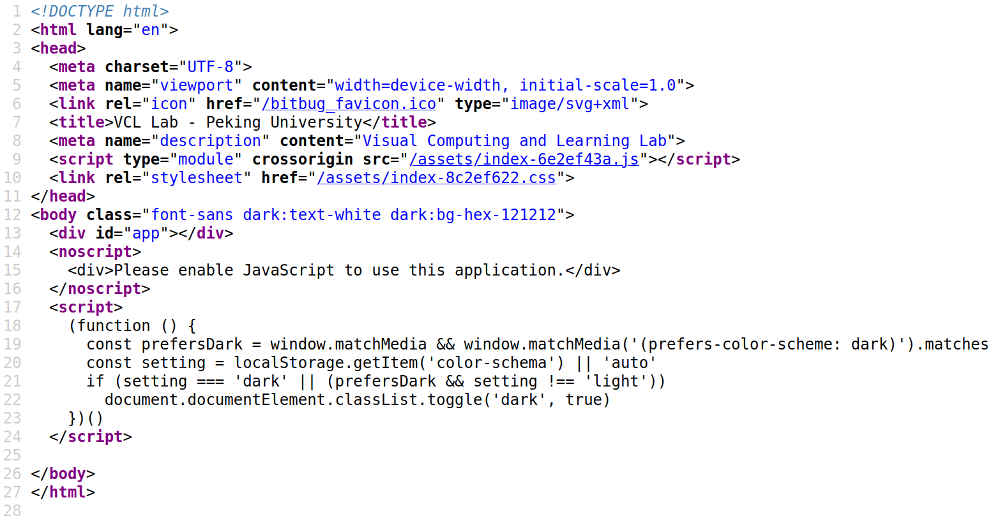

# 使用 `bash` 脚本自动下载网页的文件

有些时候我们需要批量下载一个网页的文件，比如课程网站的讲义、课件等。如果手动一个一个下载，也是可以的，但这里我分享一下我最近尝试写脚本自动下载的经验。

> [!WARNING]
> 下载文件要注意遵守法律法规！

## 没有动态渲染的网页文件下载

没有动态渲染的网页文件下载是比较容易的。首先我们需要获取网页的源代码，这可以直接通过 `wget` 或者 `curl` 得到，比如：

```bash
wget https://example.com -o temp.html # 这只是一个示例网站，应该替换为你想要的网址
```

获取了网页源代码，我们需要找出其中文件的链接。这是比较复杂的一个步骤。首先我们需要通过正则表达式匹配出文件链接的文本，然后观察其规律，变成一个完整的链接。比如

```bash
pdf_links=$(grep -oP '/[^\s"]*\.pdf' temp.html)
```

我们得到了网页所有的 `pdf` 链接相关的文本。但需要注意的是，这往往是相对路径，也就是我们需要加上前缀，一般是网页的地址，比如这样做

```bash
for link in $pdf_links; do
    full_url="${common}${link}"
done
```

我们就得到了完整的链接，通过完整的链接下载内容，比如

```bash
wget $full_url
```

一个通常的脚本可以是

```bash
#! /bin/bash
wget https://example.com -o temp.html # 这只是一个示例网站，应该替换为你想要的网址
common="https://example.com/" # 这只是一个简单示例，你需要具体调整
pdf_links=$(grep -oP '/[^\s"]*\.pdf' temp.html)
for link in $pdf_links; do
    full_url="${common}${link}"
    wget $full_url
done
```

通过这个我们就可以批量下载文件了。

## 动态渲染的网页文件下载

很多网页是动态渲染的，你需要执行其中的 `Javascript` 脚本才能得到你看到的网页的源代码。这里以北京大学可视计算与交互概论[课程网站](https://vcl.pku.edu.cn/course/vci)为例。我们通过浏览器直接查看网页源代码：



我们并没有看到我们想要的 `pdf` 链接。这是因为我们看到的网页是渲染之后的，需要执行 `Javascript` 脚本。如果我们直接用 `wget` 或者 `curl` 获取网页源代码，我们得到的跟我们上面图片中的是一样的，没有我们想要的链接。怎么办呢？一个自然的想法就是我们想办法获取渲染之后的网页源代码。这里我们用 `Node.js` 来实现这一点。我们使用 `puppeteer` 来获取渲染后的网页源代码。关于 `puppeteer` 可以参考[这篇文章](https://cloud.tencent.com/developer/article/2317303)。这里我直接给出我用到的 `Javascript` 脚本（命名为 `draw.js`）

```javascript
const puppeteer = require('puppeteer');
const fs = require('fs');

(async () => {
    // 创建浏览器
    const browser = await puppeteer.launch({
    // 下面的命令行参数主要是因为我是在 Ubuntu 上执行
    args: [
        "--no-sandbox",
        "--disable-setuid-sandbox",
      ]
    });
    // 打开新页面
    const page = await browser.newPage();

    // 前往指定网站
    // 增加等待时间，确保页面加载完成
    await page.goto('https://vcl.pku.edu.cn/course/vci', { waitUntil: 'networkidle0' });

    // 处理可能的报错，不用管，我也是问 AI 然后抄过来的
    page.on('console', message => console.log('PAGE LOG:', message.text()));
    page.on('pageerror', error => console.log('PAGE ERROR:', error));

    // 比较关键的内容，通过 evaluate 函数执行了网页的 Javascript 代码
    // 查询 body 部分的内容，当然，具体要那部分你可以自决定，只要包含需要的链接即可，这里我为了简便直接用了主体
    // 通过 outerHTML 获取选然后的网页源代码
    const text = await page.evaluate(() => {
        return document.querySelector('body').outerHTML;
    });

    // 写入文件
    fs.writeFileSync('result.html', text);
    // 关闭浏览器
    await browser.close();
})();
```

然后在我们的 `bash` 脚本中，我们就将一开始的 `wget` 命令替换为 `node draw.js` 。具体如下

```bash
#!/bin/bash
node draw.js
pdf_links=$(grep -oP '/[^\s"]*\.pdf' result.html)
common="https://vcl.pku.edu.cn"
for link in $pdf_links; do
    full_url="${common}${link}"
    wget $full_url
done
```

执行 `bash` 脚本，就可以完成自动下载了。

## 需要登陆的网页下载文件

有些时候一些网站需要登陆，这种情况下上面的方式就不能奏效了。我们需要使用 `Cookie` 来登陆。

在浏览器按 `F12` ，进入控制台，刷新页面，可以看到控制台数除了很多，一般情况下我们找到第一条，点击，在右侧出现新的一栏，找到 `Header` 一栏，下拉找到一个名为 `Cookie` 的元素，拷贝值，保存到一个文件中。这里我们命名为 `cookie.txt` 。在 `wget` 的时候加上选项 `--header` ，比如

```bash
wget --header="Cookie:${cookie}" https://example.com -o result.html
```

其中 `cookie` 值为刚才保存的值。

如果访问网页的时候就需要登陆，我们还需要在我们的 `Javascript` 脚本中也添加 `Cookie` 。为了使用我们上面得到的 `Cookie` ，我们需要先将其序列化未 `JSON` 对象，可以通过下面的脚本（我问 AI 得到的，做了一些修改）将其序列化并输出到 `cookies.json`

```bash
#!/bin/bash

# 假设cookie字符串存储在变量cookie_string中
cookie_string=$(cat cookie.txt)

# 开始构建JSON对象数组
echo "[" > cookies.json

# 分割cookie字符串为数组
IFS='; ' read -r -a cookies <<< "$cookie_string"

i=1

# 遍历每个cookie项
for cookie in "${cookies[@]}"; do
    # 提取key和value
    if [ $i -ne 1 ]; then
        echo "," >> cookies.json 
    fi
    i=2
    key=$(echo $cookie | cut -d '=' -f 1)
    value=$(echo $cookie | cut -d '=' -f 2-)
    
    # 构建JSON对象
    echo "    {\"name\": \"$key\", \"value\": \"$value\", \"domain\": \"course.pku.edu.cn\", \"path\": \"/\", \"httpOnly\": false, \"secure\": false}" >> cookies.json
done

# 结束构建JSON对象数组
echo "]" >> cookies.json # 删除最后一个逗号
```

然后在 `draw.js` 中添加如下语句

```javascript
    const cookiesJson = fs.readFileSync('cookies.json', 'utf8');
    const cookies = JSON.parse(cookiesJson);
    const page = await browser.newPage();
    for (let i = 0; i < cookies.length; i++) {
        page.setCookie(cookies[i]);
    }
```

这样就可以访问网页获取源代码，然后获取链接下载文件了。
