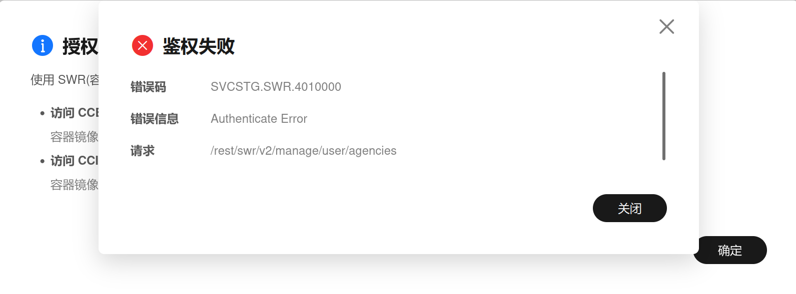
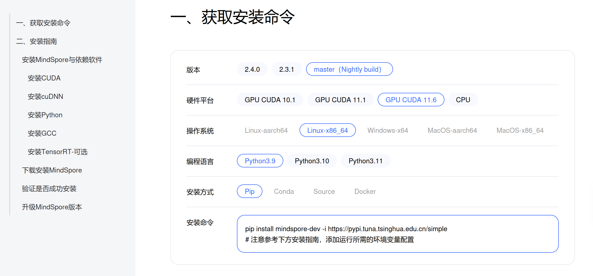
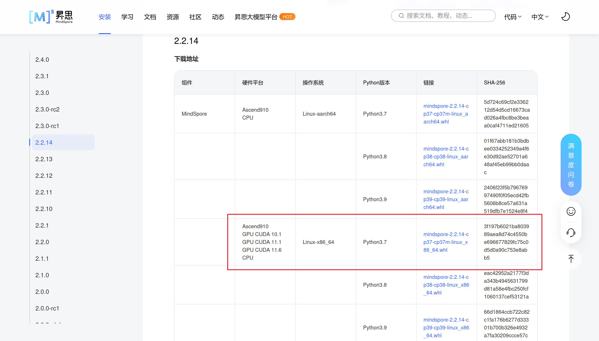

# 通过 Docker 安装 MindSpore

最近尝试用 Docker 安装 MindSpore，遇到了很多问题，这里记录和分享一下我安装的方法。

## 背景介绍

先简单介绍一下 MindSpore ，简单来说就是华为开发的一个 AI 框架，具体地介绍参见[这个](https://www.mindspore.cn/tutorials/zh-CN/r2.4.0/beginner/introduction.html) 。

再介绍一下什么是 Docker 。 可以参见[这篇文章](https://www.redhat.com/zh/topics/containers/what-is-docker)。使用 Docker 有一个好处就是不容易把本地环境弄坏，所以这里我们使用 Docker 来安装 MindSpore 。

为什么我会想安装 MindSpore 。好吧，其实没有什么说的上来的原因，只是我最近在修习一门与 AI 编译器相关的课程，查阅资料的时候发现了这个框架，想体验一下而已。

再简单说一下我的实验环境。我使用的操作系统是 Ubuntu24.04.1 ， Docker 版本为 27.3.1 ， NVIDIA 显卡驱动版本为 550.120 。
> [!WARNING]
> 这篇文章的方法并没有在各种环境进行验证，仅仅是在我的环境上证明是可行的，所以，请结合你的实际情况参考这篇文章。

## 安装 Docker 和 NVIDIA Container Toolkit

如果你已经安装了，可以跳过这一节。

首先，在开始安装 Docker 和 NVIDIA Container Toolkit 之前，你应该确保已经安装了 NVIDIA 的显卡驱动，如果你使用的是 Ubuntu24.04 ，那么系统一般是已经安装好了显卡驱动，否则的话，需要手动安装，可以参考[这篇文章](https://blog.csdn.net/qq_49323609/article/details/130310522)的第一部分进行安装。

### 安装 Docker

Docker 的安装并不容易，首先，**不要使用`apt`进行安装**，因为 `apt` 安装的版本比较落后，很可能会遇到一些奇怪的问题。可以到官网安装，但由于特殊的原因，速度会比较慢，建议使用国内的镜像源来安装。这里使用[北京大学镜像站](https://mirrors.pku.edu.cn/) ，使用这个镜像站的一个原因是它的帮助文档写得很好。具体的安装方法可以参考这篇[帮助文档](https://mirrors.pku.edu.cn/Help/Docker-ce)。

### 更换 Docker 的源

不在中国大陆的朋友可以忽略这一节。

由于特殊的原因，我们无法直接从 DockerHub 拉取镜像，所以需要使用镜像网站，但由于同样的特殊原因，很多镜像网站都已经不提供 Docker 的镜像服务了，同时很多提供相关服务的网站也无法使用了，这里推荐一个长期更新的[网站](https://xuanyuan.me/blog/archives/1154)，上面有长期更新（至少在我写这篇文章的时候还有在维护）的可用的 Docker 镜像源。

你可以在上面的这个[网站](https://xuanyuan.me/blog/archives/1154)选择几个可用的镜像源，将其添加到 `dameon.json` 中，具体的可以这样操作。

首先进入以下目录：

```bash
cd /etc/docker
```

如果这个目录下没有 daemon.json ，你需要手动创建一个，执行这条命令

```bash
sudo touch daemon.json
```

然后使用你趁手的编辑器编辑这个文件（注意，你需要 `sudo` 权限，比如如果你用 `vim` ，就应该使用 `sudo vim daemon.json`），修改后文件内容应该是这个样子

```json
{
  "registry-mirrors": [
    // 你找到的镜像源
  ]
}
```

比如我写文章的时候如下的镜像源是可用的，那么文件内容应该是

```json
{
  "registry-mirrors": [
    "https://xdark.top",
    "https://docker.1ms.run",
    "https://docker.rainbond.cc"
  ]
}
```

然后执行下面的命令

```bash
sudo systemctl daemon-reload
sudo systemctl restart docker
```

到这里，你应该就可以正常的使用 Docker 了。

### 为用户添加 docker 权限

一般我们使用 Docker 需要 `sudo` 权限，如果每一次都需要加个 `sudo` ，未免太麻烦。因此，我们需要给用户添加 `docker` 权限。执行以下命令

```bash
sudo groupadd docker
sudo gpasswd -a ${USER} docker
```

这部分参考了[文章](https://blog.csdn.net/lezeqe/article/details/107351082)。

### 安装 NVIDIA Container Toolkit

为了能在 Docker 容器里使用 GPU ，我们需要安装 NVIDIA Container Toolkit 。具体如何安装可以参考[官方文档](https://docs.nvidia.com/datacenter/cloud-native/container-toolkit/latest/install-guide.html) 。注意，安装完之后还需要配置，不要忽略了这一部分。

## 通过官方提供的 Docker 镜像安装 MindSpore

现在我们开始用 Docker 安装 MindSpore 。

### 失败的尝试

这里简单介绍一下我失败的尝试，如果你对此不感兴趣，可以跳过去，这部分内容不会影响后面内容的阅读。

首先，如果你进入官方的[安装指引](https://www.mindspore.cn/install) ，会发现根本找不到用 Docker 安装的指导。具体的原因我也不清楚，可能是最新的版本没有支持 GPU ，所以也没有打包 Docker 镜像？但我还是在 `Gitee` 的[这篇文档](https://gitee.com/mindspore/docs/blob/master/install/mindspore_gpu_install_docker.md)找到了相关的内容。按照其中的引导尝试直接使用以下命令获取最新的稳定镜像，也就是执行下面的命令

```bash
docker pull swr.cn-south-1.myhuaweicloud.com/mindspore/mindspore-gpu-{cuda_version}:{version}
```

但是我遇到了报错

```bash
Error response from daemon: Head "https://swr.cn-south-1.myhuaweicloud.com/v2/mindspore/mindspore-gpu-11.1/manifests/2.2.14": denied: You may not login yet
```

于是我去注册了华为云的账号，但在我尝试开通容器镜像服务的时候，又遇到了权限的问题：



可能是我哪里操作不当？但总之这个途径并不容易成功。

### 成功的尝试

下面介绍一个成功的尝试。这里的方案是拉取 `runtime` 标签的镜像，构建容器，然后在容器中通过 `pip` 安装 MindSpore 。

#### 拉取镜像

首先执行下面的命令，华为贴心的把镜像托管在了 `swr.cn-south-1.myhuaweicloud.com` ，所以即使你没有更换镜像源，也可以正常的拉取镜像。

```bash
docker pull swr.cn-south-1.myhuaweicloud.com/mindspore/mindspore-gpu:{tag}
```

根据[文档](https://gitee.com/mindspore/docs/blob/master/install/mindspore_gpu_install_docker.md)的提示，不推荐通过 `devl` 标签的容器安装，所以我们选择 `runtime` 标签，也就是执行下面的命令

```bash
docker pull swr.cn-south-1.myhuaweicloud.com/mindspore/mindspore-gpu:runtime
```

#### 创建容器并进入容器

然后创建容器，按照[文档](https://gitee.com/mindspore/docs/blob/master/install/mindspore_gpu_install_docker.md)的提示，我们执行下面的命令：


```bash
docker run -it -v /dev/shm:/dev/shm --name mindspore --gpus all swr.cn-south-1.myhuaweicloud.com/mindspore/mindspore-gpu:runtime /bin/bash
```

由于我们已经配置了 NVIDIA Container Toolkit ，所以我们可以不用添加 `--runtime=nvidia` 选项，同时我们添加了 `--gpus all` 选项。注意 `--name mindspore` 这个选项是在指定容器的名字，你可以删除这个选项，或者命名你喜欢的名字。

上面的命令在创建容器的同时也会进入容器的 `shell` ，你可以顺便查看 `cuda` 的版本和 `python` 的版本，也就是执行下面的命令

```bash
nvcc -V
python -v
```

一般地， `cuda` 的版本会是 cuda11.6 ，而 `python` 的版本会是 3.7.5 。

#### 安装 MindSpore

执行到这里，你应该已经进入容器了。下面来安装 `MindSpore` 。首先进入 `MindSpore` 的安装页面，也就是[这个网页](https://www.mindspore.cn/install)。根据刚才的得到的版本号选择对应的命令，你会看到这个页面



需要注意的是，我们没有找到对 `python3.7.5` 的支持，我们可能会想尝试 `python3.9` 能否可行，但是，我尝试的结果是不可行。

如果我们执行这条命令（不要执行，因为这并不能成功）

```bash
pip install mindspore-dev -i https://pypi.tuna.tsinghua.edu.cn/simple
```

我们发现确实能下载，而且下载的确实是 `python3.7` 的版本的 `MindSpore` ，但是当我们执行这篇[安装指引](https://www.mindspore.cn/install)提供的测试时，也就是执行

```bash
python -c "import mindspore;mindspore.set_context(device_target='GPU');mindspore.run_check()"
```

的时候报错了

```bash
[ERROR] ME(54:134625325205120,MainProcess):2024-11-16-08:35:58.529.19 [mindspore/run_check/_check_version.py:219] libcuda.so (need by mindspore-gpu) is not found. Please confirm that libmindspore_gpu.so is in directory:/usr/local/python-3.7.5/lib/python3.7/site-packages/mindspore/run_check/../lib/plugin and the correct cuda version has been installed, you can refer to the installation guidelines: https://www.mindspore.cn/install
[ERROR] ME(54:134625325205120,MainProcess):2024-11-16-08:35:58.530.97 [mindspore/run_check/_check_version.py:219] libcudnn.so (need by mindspore-gpu) is not found. Please confirm that libmindspore_gpu.so is in directory:/usr/local/python-3.7.5/lib/python3.7/site-packages/mindspore/run_check/../lib/plugin and the correct cuda version has been installed, you can refer to the installation guidelines: https://www.mindspore.cn/install
```

我也不知道为什么会是这样的报错，但总之这个尝试失败了。

既然最新的版本没有支持 `python3.7.5` ，我们来看历史版本。来到[安装页面](https://www.mindspore.cn/install)，点击“历史版本”，如图


找到支持 `python3.7` 的版本，我们发现 `2.2.14` 是支持 `python3.7` 的。当然，你也可以尝试其他版本。



我们注意到历史版本提供的安装方式是通过 `whl` 文件安装。这其实是 `wheel` 文件，具体地介绍可以看[这篇文章](https://deepinout.com/python/python-qa/82_python_wheel_file_installation.html)。当然，这里不需要了解那么多，只需要将其下载，然后通过 `pip` 安装就可以了。具体的可以执行下面的命令：

```bash
wget https://ms-release.obs.cn-north-4.myhuaweicloud.com/2.2.14/MindSpore/unified/x86_64/mindspore-2.2.14-cp37-cp37m-linux_x86_64.whl # 官方网站提供的那个链接
pip install mindspore-2.2.14-cp37-cp37m-linux_x86_64.whl
# 可选
rm mindspore-2.2.14-cp37-cp37m-linux_x86_64.whl
```

然后用官方网站提供的用例进行测试，执行下面的命令：

```bash
python -c "import mindspore;mindspore.set_context(device_target='GPU');mindspore.run_check()"
```

或者编写并运行如下的 `python` 文件，

```python
import numpy as np
import mindspore as ms
import mindspore.ops as ops

ms.set_context(device_target="GPU")

x = ms.Tensor(np.ones([1,3,3,4]).astype(np.float32))
y = ms.Tensor(np.ones([1,3,3,4]).astype(np.float32))
print(ops.add(x, y))
```

然后发现，我们成功安装了 `MindSpore` 了。

## 自己构建 Docker 镜像

我们也可以尝试自己构建 Docker 镜像。

### 拉取基础 cuda 镜像

为了构建 MindSpore 镜像，我们需要先拉取 nvidia/cuda 的镜像作为基础镜像。具体的可以执行下面的命令：

```bash
docker pull nvidia/cuda:11.1.1-cudnn8-runtime-ubuntu20.04
```

当然，你也可以选择其他版本的 `cuda` 镜像，也可以选择上面的官方的镜像作为基础镜像。

> [!TIP]
> MindSpore 支持的 `cuda` 版本有限，一般是 cuda10.1 ， cuda11.1 和 cuda11.6 ，选择 `cuda` 镜像的时候需要注意

### 编写 Dockerfile

为了构建 MindSpore 镜像，我们需要编写 Dockerfile 。关于 Dockerfile 的介绍和使用，可以参考[这篇文章](https://blog.csdn.net/weixin_43980547/article/details/136914370)。当然，如果不想看可以直接参考我的做法，以后有时间再去了解 Dockerfile 的内容。

创建一个目录（任意），新建 Dockerfile ，如果你使用的是 `MindSpore` 提供的镜像，写入下面内容：

```dockerfile
# 替换成上面你拉取的镜像
FROM swr.cn-south-1.myhuaweicloud.com/mindspore/mindspore-gpu:runtime

# 设置工作目录，当然你也可以修改
WORKDIR /root

# 下载 whl 文件，注意根据你的 cuda 版本和 python 版本进行修改，具体的链接可以查看 https://www.mindspore.cn/versions
RUN wget https://ms-release.obs.cn-north-4.myhuaweicloud.com/2.2.14/MindSpore/unified/x86_64/mindspore-2.2.14-cp38-cp38-linux_x86_64.whl
# 通过 pip 安装 MindSpore
RUN pip3 install ./mindspore-2.2.14-cp38-cp38-linux_x86_64.whl
# 删除不需要的 whl 文件，可选，主要是考虑到减小镜像的体积
RUN rm mindspore-2.2.14-cp38-cp38-linux_x86_64.whl
```

如果你使用的是 `nvidia/cuda` 的镜像作为镜像，那么写入下面的内容：

```dockerfile
# 替换成上面你拉取的镜像
FROM nvidia/cuda:11.1.1-cudnn8-runtime-ubuntu20.04

# 设置工作目录，当然你也可以修改
WORKDIR /root

# 更新 apt 索引并安装 wget 和 python3-pip
RUN apt update && apt install -y wget python3-pip
# 下载 whl 文件，注意根据你的 cuda 版本和 python 版本进行修改，具体的链接可以查看 https://www.mindspore.cn/versions
RUN wget https://ms-release.obs.cn-north-4.myhuaweicloud.com/2.2.14/MindSpore/unified/x86_64/mindspore-2.2.14-cp38-cp38-linux_x86_64.whl
# 通过 pip 安装 MindSpore
RUN pip3 install ./mindspore-2.2.14-cp38-cp38-linux_x86_64.whl
# 删除不需要的 whl 文件，可选，主要是考虑到减小镜像的体积
RUN rm mindspore-2.2.14-cp38-cp38-linux_x86_64.whl
# 清除 apt 缓存并删除索引，可选，主要是考虑到减小镜像的体积
RUN apt clean && rm -rf /var/lib/apt/lists/*
```

### 构建镜像

简单的，可以执行下面的命令：

```bash
docker build -t mindspore .
```

注意 `-t mindspore` 选项是指定了镜像，你可以修改，同时这里默认的标签是 `latest` ，你也可以另外指定，比如 `-t mindspore:1.1` 等。

### 运行容器

然后基于你自己构建的镜像运行一个容器，就可以直接使用 `MindSpore` 了，比如执行下面的命令：

```bash
docker run -it -v /dev/shm:/dev/shm --name my_mindspore_test_runtime --gpus all my_mindspore /bin/bash
```

注意 `my_mindspore` 需要替换为你上面构建的镜像的名字。
