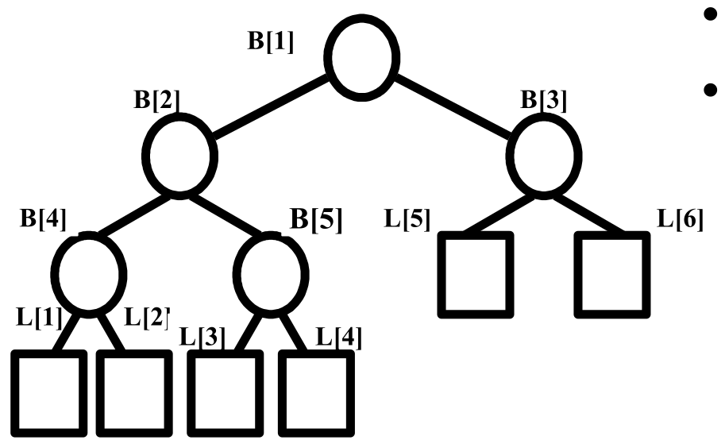
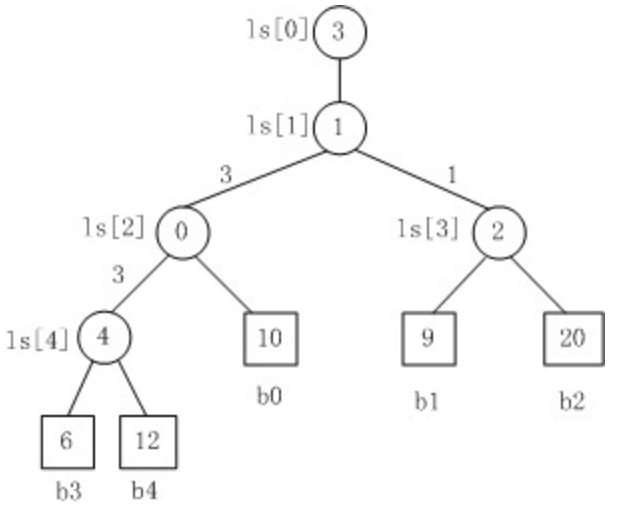

# 外排序及其 `Java` 实现

外排序不同于内排序，其数据存储在外存中，排序结果一般也是写入外存，这也使得其有许多不同于内排序的地方。本文将介绍外排序机器 `Java` 实现，我对 `Java` 程序设计和数据结构与算法都不是很熟悉，所以讲的和实现的可能并不是很好，欢迎批评指正。

## 基本介绍

当要对一个文件的数据进行排序时，我们通常的想法是将其读入内存，在内存排序后写回文件，但当数据量特别大、内存不够的时候，这种方法就无法奏效了，这就是我们需要研究外排序的原因。

文件指存储在外存上的数据结构，一般分为两种：操作系统的文件和数据库文件，数据库文件的操作我不了解，这里主要涉及操作系统的文件，关于 `Java` 如何对操作系统的文件进行操作，可以参考[这篇笔记](https://www.yuque.com/gorit/learnjava/java_se_08)。

外排序朴素的方法是每次从头到尾扫描文件，将最小的记录输出到输出文件，但这样文件读写会十分频繁，次数很多，性能不够高效，通常的方法是先对待排序的记录（在文件中）分割形成若干个排好序的文件，再将这些文件合并为一个新的结果，方法与内排序的归并排序很相似。

## 分割形成顺串

将一个大的文件的记录分割成若干个排好序的小文件，最朴素的方法应该是每次从头到尾扫描文件，遇到比当前输出文件最后一个记录（也就是上一个写入的记录）大的记录就写入输出文件，直至分割完成。但事实上这种方法并不高效，只考虑了下一个记录，不能形成尽量长的顺串，一个简单的例子是大的文件是逆序的，那么得到的小文件将都只有一个记录的，归并的时候效率也将很低。要形成尽量长的顺串，一个方法是每次不只是考虑下一个记录，而是考虑若干个记录（应该能保存在内存中），将这些记录中最小的输出，这就很容易联想到最小堆，这个方法就是置换选择排序。

我们在内存中建立一个最小堆，限制其大小为某个固定的值，从输入文件中读取记录填满这个堆（应该是能填满的，如果不能填满那事实上就是内排序中的堆排序），不同于一般地堆排序，我们不是简单的依次弹出堆顶元素，而是考虑从文件中重新读入记录替换堆定的元素。具体的思路是，如果重新读入的记录比弹出的记录要小，那么与普通的最小堆一样弹出堆顶，重新读入的记录保存在内存中但不进入最小堆（实际上是在最小堆的数组中，但调整了最小堆的大小使得这个纪录不作为最小堆的一部分）；如果重新读入的记录比弹出地记录要大，则将新的记录作为新的堆顶，重新构建最小堆。直至最小堆清空或文件全部读入，这是最小堆的数组被我们之前保存的记录填满了，重新构建最小堆，重复上面的操作，直至最小堆清空且文件全部读入。

这里用到的最小堆与通常的最小堆不同，需要支持置换操作，所以通常需要自己重新设计，基本的代码如下：

```java
/**
 * A min heap implementation for external sorting. I make it
 * package-private to avoid exposing it to the user for I think
 * it's not necessary to be used outside the package.
 *
 * @param <T> The type of the elements in the heap.
 */
class MinHeap<T extends Comparable<T>> {
    private final T[] data;
    private final int capacity;
    private int heapSize;
    private int totalSize;

    MinHeap(int capacity) {
        //noinspection unchecked
        data = (T[]) new Comparable[capacity];
        this.capacity = capacity;
        heapSize = 0;
        totalSize = 0;
    }

    /**
     * Add a value to the heap.
     * @param value The value to be added.
     */
    void add(T value) {
        if (heapSize == capacity) {
            throw new IndexOutOfBoundsException("Can't add an element to a full heap.");
        }
        data[heapSize] = value;
        heapSize++;
        totalSize++;
        swimUp(heapSize - 1);
    }

    /**
     * Replace the root of the heap with a new value.
     * @param value The new value to replace the root.
     * @return The old root value.
     */
    T replace(T value) {
        if (heapSize == 0) {
            throw new IndexOutOfBoundsException("Can't replace a empty heap.");
        }
        T result = data[0];
        if (less(value, result)) {
            data[0] = data[heapSize - 1];
            data[heapSize - 1] = value;
            heapSize--;
        } else {
            data[0] = value;
        }
        sinkDown(0);
        return result;
    }

    /**
     * Get the root value of the heap.
     * @return The root value.
     */
    T poll() {
        if (heapSize == 0) {
            throw new IndexOutOfBoundsException("Can't poll form an empty heap.");
        }
        T result = data[0];
        data[0] = data[heapSize - 1];
        data[heapSize - 1] = null;
        heapSize--;
        totalSize--;
        sinkDown(0);
        return result;
    }

    int getHeapSize() {
        return heapSize;
    }

    /**
     * Check if the heap is empty.
     * @return True if the heap is empty, false otherwise.
     */
    boolean isEmpty() {
        return heapSize == 0;
    }

    /**
     * Check if the heap is full.
     * @return True if the heap is full, false otherwise.
     */
    boolean isFull() {
        return heapSize == capacity;
    }

    /**
     * Rebuild the heap.
     */
    void reBuild() {
        heapSize = totalSize;
        for (int i = heapSize / 2 - 1; i >= 0; i--) {
            sinkDown(i);
        }
    }

    /**
     * Get the root value of the heap.
     *
     * @param i The index of the value to swim up.
     */
    private void swimUp(int i) {
        if (i == 0) {
            return;
        }
        int parent = (i - 1) / 2;
        if (less(data[i], data[parent])) {
            swap(i, parent);
            swimUp(parent);
        }
    }

    /**
     * Sink down the value at index i.
     * @param i The index of the value to sink down.
     */
    private void sinkDown(int i) {
        int left_child = i * 2 + 1;
        int right_child = i * 2 + 2;
        if (left_child >= heapSize) {
            return;
        }
        if (right_child >= heapSize) {
            if (less(data[left_child], data[i])) {
                swap(i, left_child);
                sinkDown(left_child);
            }
            return;
        }
        if (less(data[left_child], data[right_child])) {
            if (less(data[left_child], data[i])) {
                swap(left_child, i);
                sinkDown(left_child);
            }
        } else if (less(data[right_child], data[i])) {
            swap(right_child, i);
            sinkDown(right_child);
        }
    }

    private boolean less(T lhs, T rhs) {
        return lhs.compareTo(rhs) < 0;
    }

    private void swap(int i, int j) {
        T temp = data[i];
        data[i] = data[j];
        data[j] = temp;
    }
}

```

置换选择排序的算法可以使用这个最小堆，设计如下：

```java
public class ReplacementSelectionSort {

    public static void sort(String inputFilePath, String outputFileDir, int capacity) throws IOException {
        MinHeap<Integer> heap = new MinHeap<Integer>(capacity);
        BufferedReader reader = new BufferedReader(new FileReader(inputFilePath));
        int counter = 1;
        while (!heap.isFull()) {
            String line = reader.readLine();
            if (line == null) {
                break;
            }
            heap.add(Integer.valueOf(line));
        }
        while (!heap.isEmpty()) {
            String outputFilePath = outputFileDir + "/" + counter++ + ".txt";
            System.out.println(outputFilePath);
            BufferedWriter writer = new BufferedWriter(new FileWriter(outputFilePath));
            while (!heap.isEmpty()) {
                String line = reader.readLine();
                if (line == null) {
                    writer.write(heap.poll().toString());
                } else {
                    writer.write(heap.replace(Integer.valueOf(line)).toString());
                }
                writer.newLine();
            }
            writer.flush();
            writer.close();
            heap.reBuild();
        }
        reader.close();
    }
}
```

## 归并

顺串分割是比较容易的，外排序问题的复杂很多在于归并。最朴素的方法是每一次比较每一个顺串的最小元素，得到最小的输出，直至所有顺串都全部输出，或者的做法是每一次归并若干个顺串，直至全部归并。

### 二路归并外排序

每一次对两个顺串进行归并，直至得到最终的输出的方法称为二路归并外排序，基本的方法就是每一次对两个顺串归并。归并顺序的选择往往会影响归并的效率，我们应该每一次归并较小的顺串，这样可以减少读取外存的次树，这样的方法有些类似 Huffman 树，事实上这里只需要一个最小堆即可。确定归并顺序后归并就是简单的，每次将两个顺串最小值的较小值输出到输出文件即可，代码如下：

```java
public class ExternalTwoPathMerge {
    public static void merge(String[] inputFiles, String outputFile) {
        if (inputFiles.length == 1) {
            File input = new File(inputFiles[0]);
            File output = new File(outputFile);
            try {
                Files.copy(input.toPath(), output.toPath(), StandardCopyOption.REPLACE_EXISTING);
            } catch (Exception e) {
                Logger.getLogger(ExternalTwoPathMerge.class.getName()).severe(e.getMessage());
            }
        }
        PriorityQueue<File> pq = new PriorityQueue<>(Comparator.comparingLong(File::length));
        for (String file : inputFiles) {
            pq.add(new File(file));
        }
        while (pq.size() > 1) {
            File file1 = pq.poll();
            File file2 = pq.poll();
            File outputFile1 = new File(outputFile + "tempForMerge");
            try {
                assert file2 != null;
                mergeFiles(file1, file2, outputFile1);
                pq.add(outputFile1);
            } catch (IOException e) {
                Logger.getLogger(ExternalTwoPathMerge.class.getName()).severe(e.getMessage());
            }
        }
        try {
            Files.move(pq.poll().toPath(), new File(outputFile).toPath(), StandardCopyOption.REPLACE_EXISTING);
        } catch (IOException e) {
            Logger.getLogger(ExternalTwoPathMerge.class.getName()).severe(e.getMessage());
        }
    }

    private static void mergeFiles(File file1, File file2, File outputFile) throws IOException {
        BufferedReader reader1 = new BufferedReader(new FileReader(file1.getPath()));
        BufferedReader reader2 = new BufferedReader(new FileReader(file2.getPath()));
        BufferedWriter writer = new BufferedWriter(new FileWriter(outputFile.getPath()));
        String line1 = reader1.readLine();
        String line2 = reader2.readLine();
        while (line1 != null && line2 != null) {
            if (Integer.parseInt(line1) < Integer.parseInt(line2)) {
                writer.write(line1);
                line1 = reader1.readLine();
            } else {
                writer.write(line2);
                line2 = reader2.readLine();
            }
            writer.newLine();
        }
        while (line1 != null) {
            writer.write(line1);
            writer.newLine();
            line1 = reader1.readLine();
        }
        while (line2 != null) {
            writer.write(line2);
            writer.newLine();
            line2 = reader2.readLine();
        }
        reader1.close();
        reader2.close();
        writer.close();
    }
}
```

### 多路归并外排序

事实上更多用的是多路归并排序，通常对 $m$ 个顺串进行 $k$ 路归并，归并趟数为 $log_km$ ，增加归并的路数能减少归并的趟数。

多路归并的顺序安排与二路归并排序的类似，不过需要考虑虚节点，而最为不同的在于归并的方法，我们可以采用类似于二路归并是的方法，直接对每个顺串的最小值进行比较，找出最小值输出，但这样会有许多重复比较，一个比较常用的方法是比较树，通常有赢者树和败方树两种，它们都是完全二叉树。

#### 赢者树

通常的结构如下图所示：



叶子节点存储的是顺串的索引，内部节点记录的是比较的胜者，也就是较小者的索引，根节点输出的就是最后的胜者（即最小者的索引）。当最小值输出后，对应的顺串会重新读入新的记录，沿着到根节点的路径更新节点的胜者，而不需要重新比较其他的不相关记录。基本的设计可以是

```java
public class WinnerTree {
    private final int[] tree;
    private final BufferedReader[] readers;
    private final int[] currentValues;

    public WinnerTree(BufferedReader[] readers) throws IOException {
        int n = readers.length;
        this.readers = new BufferedReader[n];
        System.arraycopy(readers, 0, this.readers, 0, n);
        this.tree = new int[2 * n];
        for (int i = 0; i < 2 * n; i++) {
            this.tree[i] = 0;
        }
        // 设置叶子节点为玩家的索引
        for (int i = 0; i < n; i++) {
            tree[n + i] = i;
        }
        // 将内部节点设置为左子结点的值
        for (int i = n - 1; i > 0; i--) {
            tree[i] = tree[2 * i];
        }
        currentValues = new int[n];
        for (int i = 0; i < n; i++) {
            String line = this.readers[i].readLine();
            if (line == null) {
                currentValues[i] = Integer.MAX_VALUE;
            } else {
                currentValues[i] = Integer.parseInt(line);
            }
        }
        play();
    }

    private void play() {
        int n = currentValues.length;
        for (int i = n - 1; i > 0; i--) {
            if (currentValues[tree[2 * i]]< currentValues[tree[2 * i + 1]]) {
                tree[i] = tree[2 * i];
            } else {
                tree[i] = tree[2 * i + 1];
            }
        }
    }

    public void rePlay() throws IOException {
        int playerIndex = tree[1];
        String line = readers[playerIndex].readLine();
        if (line == null) {
            currentValues[playerIndex] = Integer.MAX_VALUE;
        } else {
            currentValues[playerIndex] = Integer.parseInt(line);
        }
        int i = (playerIndex + currentValues.length) / 2;
        while (i > 0) {
            if (currentValues[tree[2 * i]] < currentValues[tree[2 * i + 1]]) {
                tree[i] = tree[2 * i];
            } else {
                tree[i] = tree[2 * i + 1];
            }
            i /= 2;
        }
    }

    public Integer getWinner() {
        return currentValues[tree[1]];
    }
}
```

#### 败方树

与赢者树不同的是，败方树记录的是败方的索引，这样的好处是更新或者说节点上升的时候，不需要访问其子结点而可以直接与该节点上索引的值进行比较，通常败方树的根节点会再连接一个节点，记录最终的胜者，基本的结构如下：



一般的代码可以如下设计

```java
public class LoserTree {
    private final int[] tree;
    private final BufferedReader[] readers;
    private final int[] currentValues;

    public LoserTree(BufferedReader[] readers) throws IOException {
        this.readers = readers;
        this.currentValues = new int[readers.length];
        this.tree = new int[2 * readers.length];
        for (int i = 0; i < readers.length; i++) {
            String line = readers[i].readLine();
            currentValues[i] = line == null ? Integer.MAX_VALUE : Integer.parseInt(line);
        }
        buildLoserTree();
    }

    private void buildLoserTree() {
        int n = currentValues.length;
        int[] winners = new int[2 * n];
        for (int i = 0; i < n; i++) {
            tree[n + i] = currentValues[i];
            winners[n + i] = i;
        }
        for (int i = n - 1; i > 0; i--) {
            int left = i << 1;
            int right = left + 1;
            if (currentValues[winners[left]] < currentValues[winners[right]]) {
                tree[i] = winners[right];
                winners[i] = winners[left];
            } else {
                tree[i] = winners[left];
                winners[i] = winners[right];
            }
        }
        tree[0] = winners[1];
    }

    public int getWinner() {
        return currentValues[tree[0]];
    }

    public void rePlay() throws IOException {
        int index = tree[0];
        String line = readers[index].readLine();
        currentValues[index] = line == null ? Integer.MAX_VALUE : Integer.parseInt(line);
        int n = currentValues.length;
        int i = n + index;
        int winner = index;
        while (i > 1) {
            i >>= 1;
            if (currentValues[winner] > currentValues[tree[i]]) {
                int temp = winner;
                winner = tree[i];
                tree[i] = temp;
            }
        }
        tree[0] = winner;
    }
}
```
